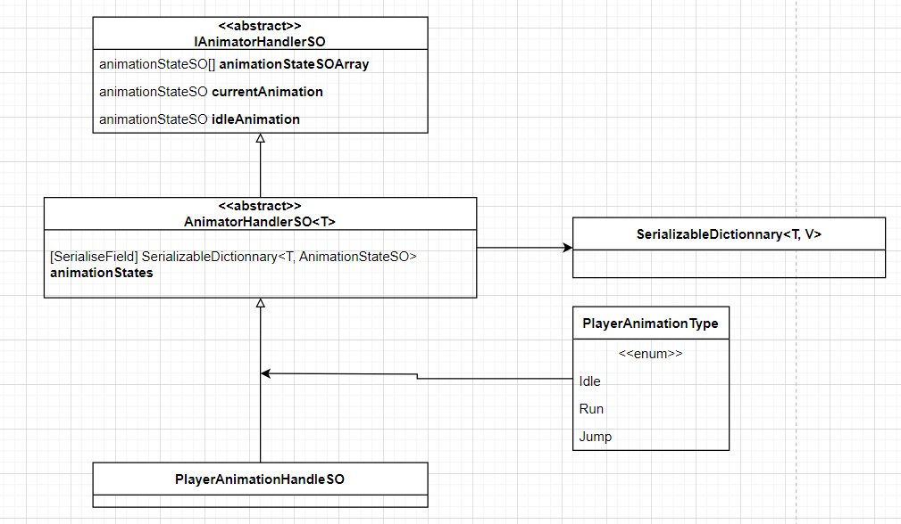
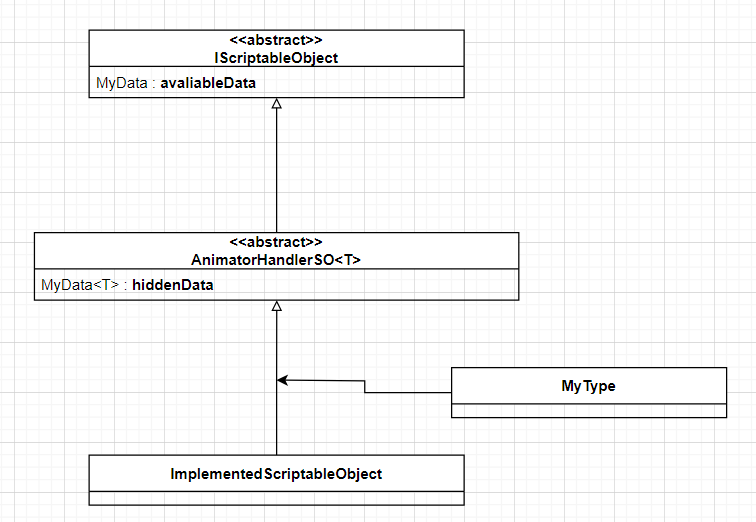

# Unity-SO-generics-and-events
Unity's example of a pattern using scriptable object, enums and generics

# Table of contents
- [Unity-SO-generics-and-events](#unity-so-generics-and-events)
- [Table of contents](#table-of-contents)
- [Why this project](#why-this-project)
- [Context : What is the problem to solve](#context--what-is-the-problem-to-solve)
  - [What do we have](#what-do-we-have)
  - [What do we want to do](#what-do-we-want-to-do)
  - [What is the problem](#what-is-the-problem)
- [Solution](#solution)
  - [First step : Create the scriptable objects](#first-step--create-the-scriptable-objects)
    - [AnimationStateSO](#animationstateso)
    - [IAnimatorHandlerSO](#ianimatorhandlerso)
    - [AnimatorHandlerSO](#animatorhandlerso)
    - [Dynamic enums](#dynamic-enums)
    - [PlayerAnimatorSO](#playeranimatorso)
  - [Second step : make it works](#second-step--make-it-works)
    - [Display Section](#display-section)
      - [SpriteAnimatorHandler](#spriteanimatorhandler)
      - [Displayers](#displayers)
    - [Control Section (Player)](#control-section-player)
- [Conclusion](#conclusion)
  - [The pattern](#the-pattern)
  - [How to use it](#how-to-use-it)


# Why this project

This project was made during a small game creation where i needed to animate sprites with imported images. From my background in software developpement, i am used to have modular and reusable code. 

# Context : What is the problem to solve

## What do we have

Firstly, we have a PNG image with multiple sprites. (Making it a 2D/UI sprite with the Sprite mode set to multiple)
For the sake of the example, we will name this sprite "Player".

## What do we want to do

We want to animate this sprite by either a loop or a sequence of images. Like the state machine used in the Animator component but this time by switching the sprite renderer's sprite.

## What is the problem

Either I don't know how to use the Animator component with images or it is not possible. So I need to create a custom solution.

# Solution

## First step : Create the scriptable objects

### AnimationStateSO

First, we need some scriptable objects to store for each animation, the list of frames that its composed of. This scriptable will also store some other values for the animation. We will name this scriptable object "AnimationStateSO".

Here is the code of the AnimationStateSO :

```csharp
using System.Collections;
using System.Collections.Generic;
using UnityEngine;

[CreateAssetMenu(fileName = "New Animation State", menuName = "Sprite Animator/AnimationState")]
public class AnimationStateSO : ScriptableObject
{
    public string animationName;
    public Sprite[] frames;
    public float framePerSecond = 10;
    public AnimationType animationType = AnimationType.Sequence;

    public enum AnimationType {
        Sequence,
        Loop
    }
    
}
```

As seen above, we also have AnimationType enum to specify if the animation is a sequence or a loop, by default it is a sequence which means that the animation will play once and stop. (Goes back to the idle state)

### IAnimatorHandlerSO

At first we need some ScriptableObject so handle and store all the animations, the current and the Idle animation (the default animation). This class is abstract, we will see later why.


```csharp
using System;
using System.Collections;
using System.Collections.Generic;
using UnityEngine;

public abstract class IAnimatorHandlerSO : ScriptableObject {
    public abstract AnimationStateSO[] AnimationStateSOArray { get; }

    public AnimationStateSO idleAnimation;
    public AnimationStateSO currentAnimation;


}
```

Now we want something to retrieve the animations and play them, by using an index, its not very practical. 


### AnimatorHandlerSO

To better handle the animations and makes it more modular, it could be nice to have an easy way to get the animation by a key. So we will use a dictionary to store the animations.

Here, we have the AnimatorHandler that is also generic and abstract. I will explain later why we need this interface.

Also we are using SerializableDictionary, which comes from this [github repository](https://github.com/EduardMalkhasyan/Serializable-Dictionary-Unity/releases/tag/V2), this allows us to use a dictionary in the inspector.

```csharp
using ProjectTools;
using System;
using System.Collections;
using System.Collections.Generic;
using System.Linq;
using UnityEngine;

//[CreateAssetMenu(fileName = "New Animator Handler", menuName = "Sprite Animator/AnimatorHandler")]
public abstract class AnimatorHandlerSO<T> : IAnimatorHandlerSO where T : Enum
{

    public SerializableDictionary<T, AnimationStateSO> animationStates;
    
    public override AnimationStateSO[] AnimationStateSOArray {
        get {
            return animationStates.Values.ToArray();
        }
    }

}
```


If we only used a dictionary, we would have to use string keys which is prone to errors. The ideal way would be to use an enum as a key. But enums can't be generated in the inspector (nativally), and they can't implement interfaces. So we can't use a interface in the dictionnary key.

### Dynamic enums 

To solve the problem of enums not being able to be generated by the inspector, i've created a script that allows a ScriptableObject to generate an enum based on a list of strings. The script also automatically load the newly generated enums so Unity compiles it and it can be used in the code and everywhere else.

>*I won't put the code of it here for two reasons, first it will be too long and second it will be out of the scope of this project. But you can find it in [this project](https://github.com/nicolas-goyon/UnityDynamicEnumGeneration).*

Greate now we have this enum : 

```csharp
public enum PlayerAnimationsTypes {
	Idle,
	Jump,
	Run
}
```

So now we have a dynamically generated enum that we can use anywhere in the code, but as said before, we can't implement an interface so we can't directly use it as a key in the dictionary. Having the generic of `AnimatorHandlerSO` specified as an enum isn't enough for Unity to be able to put a type in the scriptableObject, ScriptableObjects can't have generic types.

To make this happen we need a way to remove the generic type seen before to make it a valid scriptableObject.

### PlayerAnimatorSO

To ensure that we are using `PlayerAnimationsTypes` as the keys of the dictionary, we need to create a new class that inherits from `AnimatorHandlerSO` and specify the generic type as `PlayerAnimationsTypes`.

```csharp
using System.Collections;
using System.Collections.Generic;
using UnityEngine;

[CreateAssetMenu()]
public class PlayerAnimatorSO : AnimatorHandlerSO<PlayerAnimationsTypes>{}
```

Because we inherit of the `AnimatorHandlerSO` abstract class, we don't need to add any code of the class, we just have to specify the generic type.

And that almost done.

## Second step : make it works

So what do we have now ? 

We have the following diagram : 



The three main parts are : 
- `IAnimatorHandlerSO` : The interface that will be used to handle animations display. (mainly by keeping a look on the current animation and the idle animation)
- `PlayerAnimationHandlerSO` : The class that can be used to store and change the current animation based on the animation dictionary and keys.
- `PlayerAnimationsTypes` : The enum that will be used as keys in the dictionary and prevent errors.

### Display Section 

#### SpriteAnimatorHandler

This class will basically be responsible for changing the sprite renderer's sprite based on the current animation. It is a bit long so i won't the entire code here but we will get through the main parts.

```csharp

[RequireComponent(typeof(SpriteRenderer))]
public class SpriteAnimatorHandler: MonoBehaviour 
{
    [SerializeField] private IAnimatorHandlerSO animatorHandler;
    private IDisplayer displayer;
    //...//

}
```

Firstly we have `[RequireComponent(typeof(SpriteRenderer))]` to ensure that the script is attached to a GameObject with a SpriteRenderer component.

Then we have a **SerializeField** `IAnimatorHandlerSO` that will be used to get the current animation and the idle animation.

The `IDisplayer` is an interface that will be used to display the sprite. I am using an interface to handle either a loop renderer or a sequence renderer. 

```csharp
private void Start() {
    CleanDisplayer();
    SetDisplayer();
}
```

Here, the Start method is used to clean any displayers that could be attached to the GameObject and set the displayer based on the current animation defined by the inspector.

```csharp
private void Update() {
    if (animatorHandler.currentAnimation == null) { // If the current animation is null, set the idle animation
        animatorHandler.currentAnimation = animatorHandler.idleAnimation;
        ChangeAnimation(animatorHandler.idleAnimation);
    }
    if (displayer == null) SetDisplayer(); // If their is no displayer, set it

    if (displayer.AnimationDisplaying != animatorHandler.currentAnimation) { // If the animation is different from the current animation, change it
        ChangeAnimation(animatorHandler.currentAnimation);
        Debug.Log("Animation changed");
    }
}
```

Basically here we are checking if we are displaying the correct animation. If not, we change it.

```csharp
private void SetDisplayer() {
    switch (animatorHandler.currentAnimation.animationType) {
        case AnimationStateSO.AnimationType.Loop:
            LoopDisplayer();
            break;
        case AnimationStateSO.AnimationType.Sequence:
            SequenceDisplayer();
            break;
    }
}


private void LoopDisplayer() {
    displayer = this.AddComponent<LoopDisplayer>();
}

private void SequenceDisplayer() {
    displayer = this.AddComponent<SequenceDispayer>();
}
```

Here the displayers are Components so it can use the method Update from MonoBehaviour to display the sprite and update accordingly. It is easier than making a coroutine or things like this.

```csharp
private void CleanDisplayer() {
    displayer?.DestroySelf();

    IDisplayer[] displayers = GetComponents<IDisplayer>();
    foreach (IDisplayer displayer in displayers) {
        displayer.DestroySelf();
    }

    LoopDisplayer[] loopDisplayers = GetComponents<LoopDisplayer>();
    SequenceDispayer[] seqDisplayers = GetComponents<SequenceDispayer>();

    foreach (LoopDisplayer displayer in loopDisplayers) {
        displayer.DestroySelf();
    }

    foreach (SequenceDispayer displayer in seqDisplayers) {
        displayer.DestroySelf();
    }

}
```

Here we are cleaning the displayers to avoid having multiple displayers on the same GameObject. It can be overkill but I prefer making sure that only one IDisplayer component is attached to the GameObject.


#### Displayers 

<u>IDisplayer</u>

IDisplayer is an interface that will be used to display the sprite. It is used to handle either a loop renderer or a sequence renderer. The main thing is The handler needs to be able to ask the displayers to destroy themselves or checking which animation is currently displaying.

I also added IsPlaying with a get and set to be able to stop the animation if needed.

```csharp
public interface IDisplayer
{
    public bool IsPlaying { get; set; }
    public void DestroySelf();
    public AnimationStateSO AnimationDisplaying { get; }
}
```

<u>LoopDisplayer</u>

Here also I won't put the entire code but the concept is very simple :

1. Get the sprite renderer
2. Get the handler and the current animation
3. Display the sprite based on the current animation and the frame per second.

<u>SequenceDisplayer</u>

Also very simple, the only thing is to be able to call the handler to set the animation back to the idle animation when the animation is finished. (or other things if needed)


### Control Section (Player)

This part is controlled by the player visual script like if we were using the Animator component. We need the `PlayerAnimationHandlerSO` to be able to change the current animation and still access the dictionary of animations by the enum keys.

Here I've been using a simple script to show how using it. It is very simple :

```csharp
public class PlayerVisuals : MonoBehaviour
{
    [SerializeField] private PlayerAnimatorSO animatorHandler;
    [SerializeField] private PlayerMovements playerMovements;

    private bool wasMoving = false;

    // Update is called once per frame
    void Update() {
        if (playerMovements.IsMoving && !wasMoving) {
            animatorHandler.currentAnimation = animatorHandler.animationStates[PlayerAnimationsTypes.Run];
            wasMoving = true;
        }
        else if (!playerMovements.IsMoving && wasMoving) {
            animatorHandler.currentAnimation = animatorHandler.animationStates[PlayerAnimationsTypes.Idle];
            wasMoving = false;
        }
    }
}
```

Here I am just checking if the script responsible of the player movements is moving or not. If it is moving, I set the current animation to the Run animation, if not I set it to the Idle animation.

Only by changing the ScriptableObject's current animation, the sprite will change accordingly.

# Conclusion

As seen before, this pattern is very modular and can be used in many different ways. It is also very easy to add new animations and to change the current animation. But also could be improved.
Also this patterns makes easy to use by having a small amount of code once the pattern is set up.

## The pattern

The main goal is to have a modular ScriptableObject that handle Generics : 



The only thing is to have a way to create a representation of MyData<T> to MyData. I my example was that `SpriteAnimatorHandler` does not need any key or enum to work. So I was just able to "Cast" the dictionnary to an array of `AnimationStateSO`.

## How to use it

Once this pattern is set up, here are the steps to add a new animation to a new sprite : 
- Create a new Animation enum by the dynamic enum generation script
- Create a some AnimationStateSO objects and set the frames and the frame per second
- Create a PlayerAnimatorSO (the setup script)
- Create one instance of the PlayerAnimatorSO and set the animations in the inspector.
- Create a new GameObject (the player object) 
- Create a sub GameObject and add `SpriteAnimatorHandler` to it
- Set the PlayerAnimatorSO object to the `SpriteAnimatorHandler`

And then manage the PlayerAnimatorSO object by a script to change the current animation.

